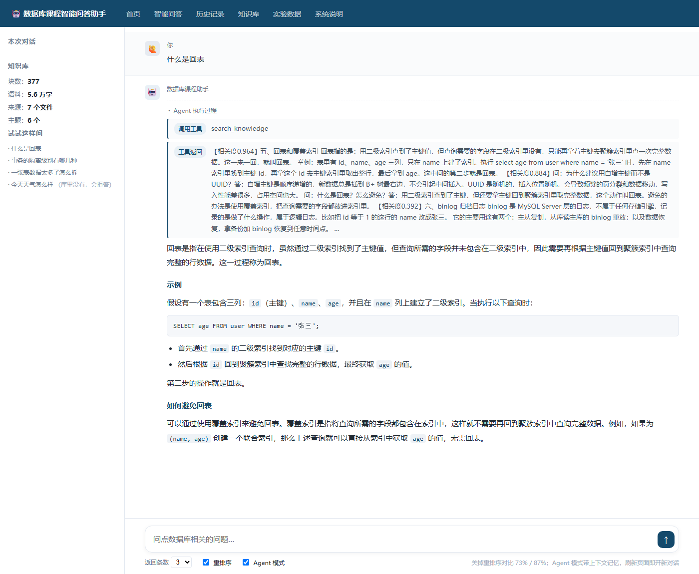

# 数据库课程智能问答系统（RAG + Agent）

一个从零手写的 **RAG（检索增强生成）** 垂直领域问答系统，知识库覆盖 MySQL 数据库课程内容。

> **检索层不依赖任何 RAG 框架**——切块、向量化、余弦检索、BM25、混合检索、重排序全部手写实现，每一步都可解释、可替换。
>
> 在检索层之上用 **LangChain + LangGraph** 加了一层 Agent：由模型自己决定要不要查资料，并用 `checkpointer` 实现多轮对话记忆。
>
> 配套 40 条人工标注测试集做了四方案检索对比实验，命中率从 73% 提升到 **87%**。



---

## 核心特性

| 特性 | 说明 |
|---|---|
| **手写检索层** | 不依赖 LangChain 等框架，每一步都可解释、可替换 |
| **两阶段检索** | 向量粗筛 top10 → rerank 精排 top3，命中率从 73% 提升到 **87%** |
| **幻觉抑制** | 提示词约束为主 + 分数阈值粗筛为辅，域外问题拒答率 **90%** |
| **完整评测体系** | 40 条人工标注测试集（20 术语 + 10 口语 + 10 域外）+ 自动化评测脚本 |
| **Agent 自主调度** | 检索层封装为 Tool，由模型判断是否需要检索——问候类问题直接作答，省掉一次检索开销 |
| **多轮对话记忆** | `checkpointer` + `thread_id` 维护上下文，追问能正确指代上文 |
| **流式输出** | FastAPI + SSE，检索结果、工具调用轨迹与答案逐字呈现 |
| **问答历史持久化** | SQLAlchemy + MySQL 存储每次问答，提供历史查询接口与页面 |
| **零框架前端** | 原生 HTML / CSS / JavaScript 实现类 ChatGPT 对话界面 |

---

## 实验结果

测试集：30 条域内问题（20 条术语题 + 10 条口语题），指标为 **top1 命中率**。

| 检索方案 | 术语题 | 口语题 | 合计 | 对比基线 |
|---|---|---|---|---|
| ① 纯向量检索 | 19/20 | 3/10 | 22/30 = **73%** | 基线 |
| ② BM25 关键词 | 20/20 | 5/10 | 25/30 = **83%** | +10% |
| ③ 混合检索（RRF 融合） | 19/20 | 4/10 | 23/30 = **77%** | **−6%** |
| ④ **向量 + rerank（两阶段）** | **20/20** | **6/10** | **26/30 = 87%** | **+14%** |

**结论：**

1. **rerank 是唯一有效的优化**，命中率提升 14 个百分点，并让向量检索反超 BM25。
2. **混合检索（RRF）反而下降。** 原因是 RRF 平等对待两路结果，而本次实验中两路强弱悬殊（BM25 83% vs 向量 73%），平等融合等于把强的那一路拖下水。**混合检索有效的前提是两路势均力敌。**
3. **问题出在"排序"而非"召回"。** 将向量 top10 与 BM25 top10 取并集后再 rerank，结果仍是 26/30，与只用向量 top10 完全相同——说明向量检索的候选池里已经有正确答案，只是排序不对。

### 幻觉控制指标

| 指标 | 结果 |
|---|---|
| 域内检索命中率 | 20/20 = 100% |
| 域外拒答率 | 9/10 = 90% |
| 阈值分类准确率 | 28/30 = 93.3% |

> 补充的**对照实验**发现：在另一份语义重叠度较高的语料上，域外问题的得分（0.605）甚至高于域内问题（0.593），阈值完全失效；而在本项目的专业技术语料上，域内最低 0.618、域外最高 0.470，存在 0.148 的清晰空档。
>
> **结论：阈值的有效性依赖语料特性，不存在通用阈值。** 因此本系统以**提示词约束为主防线，阈值仅作粗筛**，并设计了三档策略：≥0.6 直接作答 / 0.4~0.6 交模型判断 / <0.4 直接拒答。

---

## Agent 层

检索层之上加了一层 Agent：**由模型自己决定「要不要查资料」**，而不是每个问题都无脑检索一遍。

| 能力 | 实现 |
|---|---|
| **工具化** | 用 `@tool` 把检索层封装成 `search_knowledge`——函数的 **docstring 就是写给模型看的调用说明**，类型标注就是参数 Schema |
| **自主决策** | `create_agent(model, tools, system_prompt)`。实测问候类问题直接作答不调用工具，省掉一次向量检索 + rerank 的网络开销 |
| **多轮记忆** | `checkpointer=InMemorySaver()` + `thread_id` 区分会话。实测同一会话里追问「那怎么避免它？」，模型能正确指代上一轮的「回表」，**且这一轮没有触发检索**，直接复用上下文作答；换成新 `thread_id` 则会反问「您指的是避免什么」 |
| **流式轨迹** | `/agent_stream` 用 `astream(stream_mode='messages')` 把图内部的消息片段逐条转发，前端能看到「调用工具 → 工具返回 → 逐字生成」的完整过程 |

### Agent 模式的数据流

```
提问 → Agent 判断是否需要检索
         ├─ 需要 → 调用 search_knowledge（向量粗筛 → rerank 精排）
         │         → 结果回填给模型 → 生成回答
         └─ 不需要 → 直接生成回答（问候、闲聊、纯上下文追问）
       → 全过程以 SSE 逐条推送：tool_call / tool_result / text / done
```

---

## 系统架构

```
用户提问
    │
    ▼
┌────────────────────────────────────────────────────┐
│  第 5 层  Web 层    FastAPI 接口 / SSE 流式 / 前端  │
├────────────────────────────────────────────────────┤
│  第 4 层  Agent 层  LangChain create_agent          │
│                    工具调用 · 多轮记忆 · 流式轨迹    │
├────────────────────────────────────────────────────┤
│  第 3 层  检索层    切块→向量化→余弦→rerank（手写）  │
├────────────────────────────────────────────────────┤
│  第 2 层  数据层    向量库 / MySQL 问答历史          │
├────────────────────────────────────────────────────┤
│  第 1 层  模型层    bge-m3 / DeepSeek-V3 / reranker │
└────────────────────────────────────────────────────┘
```

### 数据流

**建库阶段（离线执行一次）**

```
语料 txt → 读取 → 按空行切块（385 块 → 合并过短块后 377 块）
        → 逐块向量化（bge-m3，1024 维）→ 存入 vector.json
```

**问答阶段（每次提问执行）**

```
提问 → 转向量 → 与库中 377 个向量计算余弦相似度 → 取 top10
     → rerank 精排取 top3 → 组装提示词（规则 + 资料 + 问题）
     → DeepSeek 流式生成 → 返回答案与引用出处
     → 完整答案落库（MySQL qa_history 表）
```

---

## 接口一览

| 接口 | 说明 |
|---|---|
| `GET /` | 问答页面 |
| `GET /ask?q=&top_k=&use_rerank=` | 一次性返回答案与引用出处 |
| `GET /ask_stream?q=&top_k=&use_rerank=` | SSE 流式返回（先推检索结果，再逐字推答案） |
| `GET /agent?q=&thread=` | Agent 模式，一次性返回答案与执行轨迹 |
| `GET /agent_stream?q=&thread=` | Agent 模式 + SSE（工具调用、工具返回、逐字答案） |
| `GET /history?limit=` | 从 MySQL 读最近的问答记录 |

---

## 项目结构

```
rag_agent/
├── build_index.py          建库脚本（语料 → 向量库）
├── ask.py                  命令行提问
├── evaluate.py             评测脚本（40 条测试集）
├── compare.py              四方案对比实验脚本
├── agent_ask.py            Agent 命令行测试
├── serve.py                启动 Web 服务（端口 8001）
├── requirements.txt
│
├── src/
│   ├── config.py           统一配置（路径、密钥、模型名、检索参数）
│   ├── core/               检索层（全部手写）
│   │   ├── loader.py       读取语料
│   │   ├── splitter.py     按空行切块 + 合并过短块
│   │   ├── embedder.py     调用向量化接口
│   │   ├── store.py        向量库读写（含模块级缓存）
│   │   ├── retriever.py    余弦检索 + 两阶段检索
│   │   ├── bm25.py         BM25 关键词检索（字符二元组）
│   │   ├── hybrid.py       RRF 倒数排名融合
│   │   └── rerank.py       重排序
│   ├── llm/
│   │   ├── prompts.py      提示词模板（含幻觉抑制规则）
│   │   └── client.py       大模型调用（含流式）
│   ├── rag/
│   │   └── pipeline.py     流程编排
│   ├── agent/              Agent 层（LangChain + LangGraph）
│   │   ├── tools.py        把检索层封装成 Tool
│   │   └── graph.py        create_agent + checkpointer 多轮记忆 + 流式
│   ├── db/
│   │   ├── models.py       SQLAlchemy 模型（qa_history 表）
│   │   └── history.py      问答历史的写入与读取
│   └── api/
│       └── main.py         FastAPI 接口
│
├── web/                    前端（原生三件套）
│   ├── index.html          智能问答（类 ChatGPT 界面）
│   ├── history.html        问答历史（读 MySQL 真实记录）
│   ├── home.html           系统概况
│   ├── kb.html             知识库统计
│   ├── eval.html           实验数据
│   ├── about.html          系统说明
│   ├── app.js              问答页逻辑（流式接收、Agent 执行过程）
│   ├── md.js               手写极简 Markdown 渲染器
│   ├── history.js          历史记录页逻辑
│   ├── nav.js              公共导航栏
│   └── style.css
│
├── data/
│   ├── raw/                语料（7 个 txt，约 5.6 万字）
│   └── vector.json         向量库（本地生成，未入库）
│
└── tests/
    └── eval_set.json       40 条评测测试集
```

---

## 快速开始

### 1. 安装依赖

```bash
pip install -r requirements.txt
```

### 2. 配置密钥与数据库

- 在 `src/config.py` 中修改 `API_KEY_FILE`，指向存放 **硅基流动** API 密钥的文本文件；
- 修改 `DB_URL`，指向你自己的 MySQL 库（问答历史用）。

```bash
# 建一张历史表（首次运行自动创建，也可手动执行）
CREATE DATABASE fastapi_orm DEFAULT CHARSET utf8mb4;
```

### 3. 建立索引

```bash
python build_index.py
```

会读取 `data/raw/` 下所有 txt，切块、向量化，生成 `data/vector.json`。

### 4. 提问与评测

```bash
python ask.py            # 命令行提问
python evaluate.py       # 跑评测集
python compare.py        # 四种检索方案对比
python agent_ask.py      # Agent 模式命令行测试
```

### 5. 启动 Web 服务

```bash
python serve.py
```

浏览器打开 <http://127.0.0.1:8001>，勾选底部的「Agent 模式」可以体验带多轮记忆的流式问答。

---

## 技术栈

| 层 | 技术 |
|---|---|
| 语言 / 框架 | Python 3.11、FastAPI、SQLAlchemy |
| 向量化模型 | `BAAI/bge-m3`（1024 维） |
| 生成模型 | `deepseek-ai/DeepSeek-V3` |
| 重排序模型 | `BAAI/bge-reranker-v2-m3` |
| 检索实现 | 手写余弦相似度、手写 BM25、RRF 融合 |
| Agent | LangChain `create_agent` + LangGraph `InMemorySaver` |
| 前端 | 原生 HTML / CSS / JavaScript |
| 流式输出 | SSE（Server-Sent Events） |

---

## 设计取舍与踩过的坑

**1. 为什么检索层手写，调度层却用框架？**

检索层是项目的**核心差异点**，手写才能解释清楚每一个环节（切块粒度、相似度公式、融合权重），也方便做对比实验；而 Agent 的调度循环本质是「模型 → 判断 → 调工具 → 回填 → 再生成」，是标准的工程模式，用成熟框架更稳。**该手写的地方手写，该用轮子的地方用轮子。**

**2. 为什么最终没用混合检索？**

实验数据说了算：RRF 融合后命中率从 83% 掉到 77%。原因是两路强弱悬殊时，RRF 的平等融合会稀释强的那一路。这个反直觉的结果说明——**优化手段必须用数据验证，不能因为"听起来更高级"就上**。

**3. 为什么阈值只当"粗筛"？**

因为对照实验证明阈值依赖语料特性，不存在通用阈值。系统的第一道防线是**提示词约束**（明确要求"资料里没有的就直说没有"），阈值只负责挡掉明显不相关的问题。

**4. rerank 之后，原来的阈值必须重新标定。**

向量检索的分数是余弦相似度（0~1 有明确含义），rerank 之后变成模型给出的 `relevance_score`，**两者量纲不同、不可直接比较**。改检索方案时如果忘了重标定阈值，拒答逻辑会悄悄失效。

---

## 说明

知识库内容由本人整理编写，参考了 MySQL 官方文档、课程教材及公开技术资料，涵盖索引、事务、存储引擎、锁、性能优化、其他常用功能等 6 个主题。
